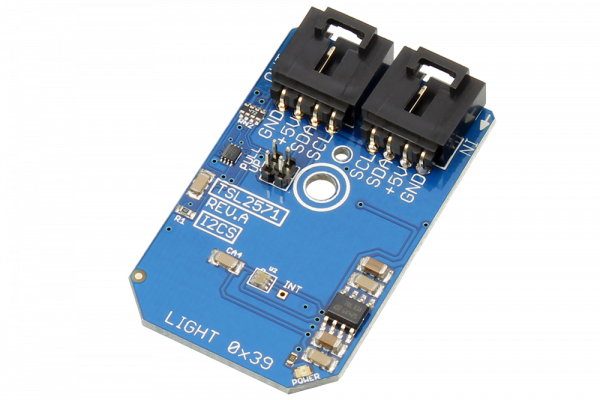

[](https://store.ncd.io/product/tsl2571-light-to-digital-converter-programmable-analog-gain-i2c-mini-module/).

#  TSL2571

The TSL2571 is a light-to-digital device with, on-chip photo-diodes, integrating amplifiers, ADCs and a 400 kHz I2C interface.  Packaged into a convenient I2C Mini Module, the TSL2571 provides ambient light sensing (ALS) that approximates human eye response to light intensity under a variety of lighting conditions and through a variety of attenuation materials. 
This Device is available from www.ncd.io 

[SKU: TSL2571]

(https://store.ncd.io/product/tsl2571-light-to-digital-converter-programmable-analog-gain-i2c-mini-module/)
This Sample code can be used with Raspberry Pi.

Hardware needed to interface TSL2571 light to digital converter sensor With Raspberry Pi :
1. <a href="https://store.ncd.io/product/tsl2571-light-to-digital-converter-programmable-analog-gain-i2c-mini-module/">TSL2571 light to digital converter sensor</a>
2.  <a href="https://store.ncd.io/product/i2c-shield-for-raspberry-pi-3-pi2-with-outward-facing-i2c-port-terminates-over-hdmi-port/">Raspberry Pi I2C Shield</a>
3. <a href="https://store.ncd.io/product/i%C2%B2c-cable/">I2C Cable</a>

## Python
Download and install smbus library on Raspberry pi. Steps to install smbus are provided at:

https://pypi.python.org/pypi/smbus-cffi/0.5.1

Download (or git pull) the code in pi. Run the program.

```cpp
$> python TSL2571.py
```
The lib is a sample library, you will need to calibrate the sensor according to your application requirement.
